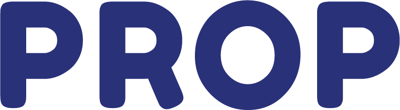
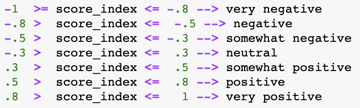

# Inspiration
The fast pace of the modern era has induced a great deal of stress among people, especially amongst Millennials and Generation Z population. While there are applications which aid in managing mental and physical health (such as fitness and nutritional apps), there are no applications dedicated explicitly to measure and promote happiness and stress level on a regular basis. 
We want to leverage AI to better assess and predict people's happiness level. The data can then be used to provide recommendations to the user depending on their current or predicted emotions, to reinforce positivity and to remind the user that they are not going through tough times by themselves.

# What it does
The application allows clients to detect their happiness level on a daily basis based on various channels. Prop measures clients' text interaction on Twitter, Facebook, Instagram, Whatsapp, Gmail, Search History along with music (Spotify) and movie (Netflix) preferences, to come up with a score index that monitors happiness ranging from -1 to 1.

We also provide a chart of the historical index, and thus motivates the clients to strive for better happiness levels.

The score index range breakdown is as below :



# How we built it
We used HTML / JS / CSS for the frontend.
The backend runs on Flask, pulling live data from Twitter for a user handle and calculates sentiment scores using Google Cloud NLP.
### Running the backend
```
$ cd backend
$ virtualenv venv
$ source venv/bin/activate
$ pip install -r requirements.txt
$ flask run
```
You'd also need a json file from Google Cloud Language for auth**

# Accomplishments that we're proud of
We are proud of the prototype that we were able to build within less than 24-hour, particularly in the live twitter API and the Javascript for the front-end.

# What we learned
Overall it was a great learning experience for us. We discovered things in NLP we previously had not known and learnt totally new concepts such as valence score as they were required for our project to work.
We were initially trying to build the front-end with React but having different CSS stylesheets made it difficult.

# What's next for Prop
In the future, we plan to:
1. Merge additional data points to more accurately predict our clients’ mood through other services like Whatsapp, text messages, email, search history, and Clients’ Survey Answers).
2. Develop partnerships with therapists to facilitate therapy appointment suggestions for customers having a constantly low happiness index. 
3. Provide recommendations on what activities can be done if we are to predict a decrease in the happiness index. These suggestions can be to watch a movie, going to a restaurant, listening to music etc. 
